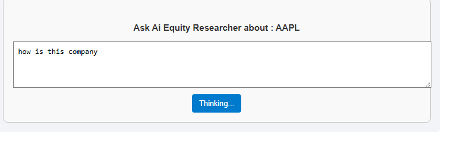
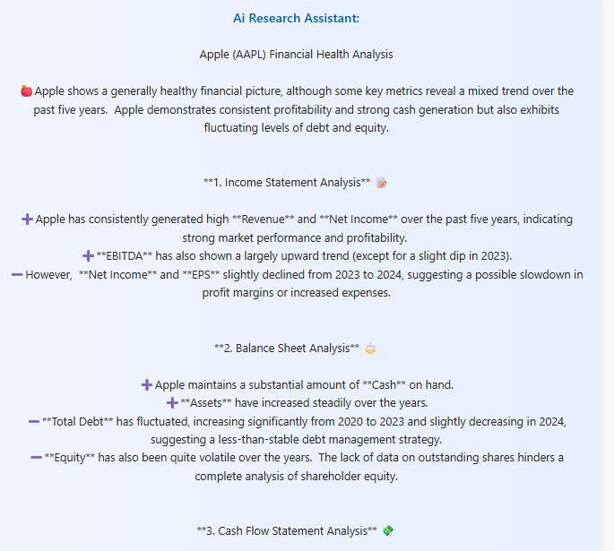

Here's your **complete `README.md`** in a single terminal-friendly format — no external file splitting, no download needed. Just copy and paste directly into your terminal or a markdown file:

---

````markdown
# 📊 Financial Dashboard with AI Assistant

A modern and interactive financial dashboard built with **React**, fetching real-time stock financials (Income Statement, Balance Sheet, Cash Flow) using the [Financial Modeling Prep API](https://financialmodelingprep.com/). Also features a smart 🤖 AI assistant to interpret company data and help users understand financials in plain English.

---

## 🔧 Features

- 🔍 Search any stock by ticker symbol (e.g., `AAPL`, `TSLA`, `GOOGL`)
- 📈 Displays 5-year history of:
  - Revenue, Net Income (Income Statement)
  - Total Assets, Liabilities (Balance Sheet)
  - Operating, Investing, Financing Cash Flows (Cash Flow Statement)
- 🧠 AI Assistant:
  - Ask: “Can I perform DCF?”, “Is the company profitable?”, etc.
  - Returns insights based on financials
- 🔄 Debounced search input to reduce API load
- ⚙️ Error handling and loading states

---

## 🛠️ Technologies Used

- React
- Gemini API
- Financial Modeling Prep API
- useState, useEffect, useRef
- TailwindCSS or custom CSS

---

## 🖼️ Screenshots

### 🏠 Dashboard Overview


### 🔍 Search Bar


### 📊 Financials Table


### 🤖 AI Input



### 🧠 AI Result




## 📦 Folder Structure

```
/src
├── components/
│   ├── TickerSearch.jsx
│   ├── FinanceSearch.jsx
│   └── GeminiChat.jsx
├── Utils/
│   └── GeminiPrompt.js
├── App.jsx
└── main.jsx
```

---

## 🧪 Sample AI Prompts

- "Is revenue growing?"
- "What’s the cash position?"
- "Compare liabilities vs assets."

---

## 🧹 Debounce Setup

```js


Used in `SearchBar.jsx` with `useRef`.

---

## 💡 Future Features

- Stock charting (Price history)
- DCF Calculator integration
- Export to Excel/PDF
- Compare multiple companies

---

## 🤝 Contributing

1. Fork the project
2. Create a new branch (`feat/your-feature`)
3. Commit changes
4. Push and open a PR

---

## ⚖️ License

MIT © 2025 Your Name

---


```
````
