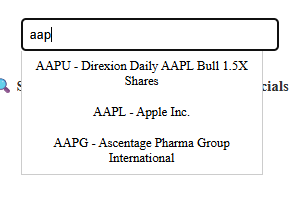
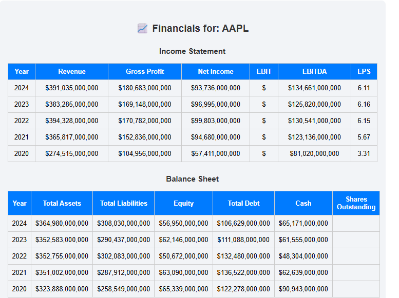
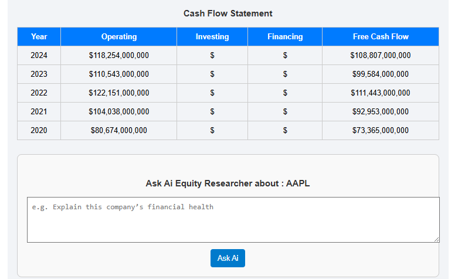
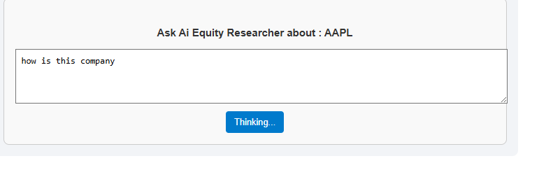
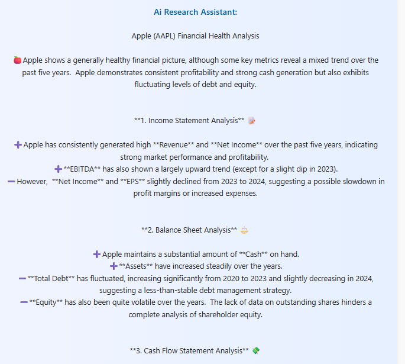
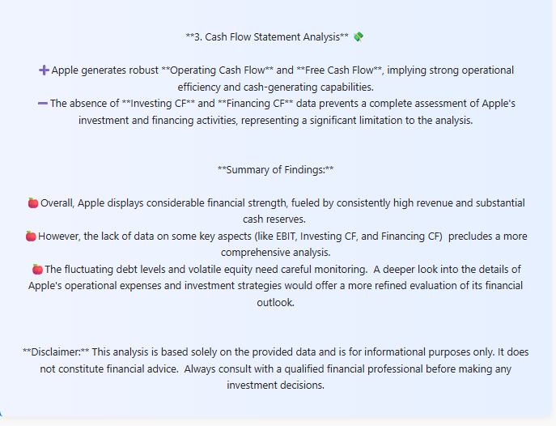

# 📊 Financial Dashboard with AI Assistant

A modern and interactive financial dashboard built with **React**, fetching real-time stock financials (Income Statement, Balance Sheet, Cash Flow) using the [Financial Modeling Prep API](https://financialmodelingprep.com/). Also features a smart 🤖 AI assistant to interpret company data and help users understand financials in plain English.

---

## 🔧 Features

- 🔍 Search any stock by ticker symbol (e.g., `AAPL`, `TSLA`, `GOOGL`)
- 📈 Displays a 5-year history of:
  - Revenue, Net Income (Income Statement)
  - Total Assets, Liabilities (Balance Sheet)
  - Operating, Investing, Financing Cash Flows (Cash Flow Statement)
- 🧠 AI Assistant:
  - Ask: “Can I perform DCF?”, “Is the company profitable?”, etc.
  - Returns insights based on financials
- 🔄 Debounced search input to reduce API load
- ⚙️ Error handling and loading states

---

## 🛠️ Technologies Used

- React
- Gemini API
- Financial Modeling Prep API
- `useState`, `useEffect`, `useRef`
- TailwindCSS or custom CSS

---

## 🖼️ Screenshots

### 🏠 Dashboard Overview

### 🔍 Search Bar

### 📊 Financials Table

### 🤖 AI Input

### 🧠 AI Result

---
